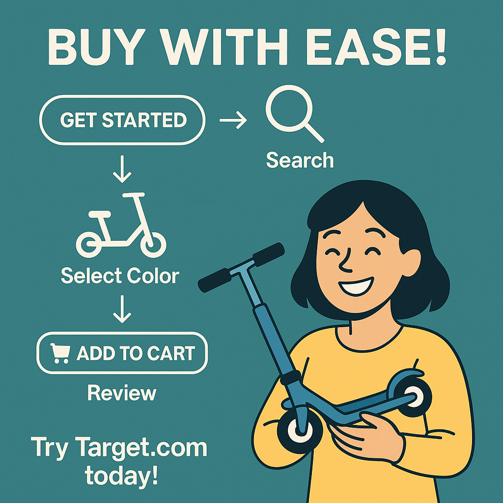

## User Interactions
- Clicked "Get Started" on Target.com  
- Tapped search bar  
- Clicked scooter image  
- Selected color for scooter  
- Explored color options  
- Clicked "Add to cart" for scooter  
- Selected to decline coverage  
- Visited cart to review items

## User Summary
The user began shopping on Target.com, searched for a scooter, explored its color options, added it to the cart while opting out of additional coverage, and reviewed the final cart.

## Social Media Image
